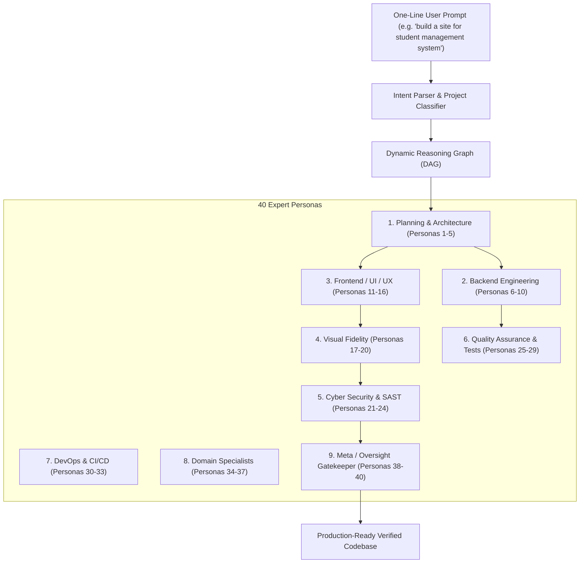

# Nexus Forge (@nexus-forge/orchestrator)

> Single-Model Multi-Persona Agent Orchestration Framework for Antigravity IDE
> Graph-based reasoning with 40 expert personas, automated self-critique loops, visual fidelity evaluation, and 30 verification layers. Zero external AI API calls or per-agent credentials.

---

## 1. Overview

Nexus Forge transforms a single AI model into a collaborative system of 40 specialized expert personas. Unlike naive retry loops, Nexus Forge operates on a Directed Acyclic Reasoning Graph (DAG):
- Dependency Edges: Downstream engineers execute only after upstream architectural contracts and database schemas are verified.
- Critique Edges: QA and Security auditors attach quantitative reviews (0 to 100) to evaluate code quality, visual fidelity, and security posture.
- Revision Edges: If an output does not meet principal-level quality thresholds, non-destructive revision nodes (v1 -> v2 -> v3) are created with full audit history.
- Convergence Guarantees: Nodes finalize when critique scores meet or exceed threshold with a hard circuit-breaker cap to prevent infinite cycles.
- Strict Isolation: No external AI SDKs or API keys needed. All persona prompts are deterministically orchestrated through Antigravity IDE's native model.

---

## 2. System Architecture



---

## 3. Quick Start

### Installation

```bash
# Clone or navigate to the workspace
cd d:\Multi-Agent

# Install dependencies
npm install

# Build TypeScript
npm run build
```

### CLI Commands

```bash
# 1. Run multi-agent orchestration on a prompt
npx tsx src/bin/nexus-forge.ts run "build a site for student management system" -o output/student-management-system

# 2. View all 40 expert personas across 9 disciplines
npx tsx src/bin/nexus-forge.ts roster

# 3. Run high-performance benchmark suite
npm run benchmark

# 4. Run full 30-layer verification test suite
npm test
```

---

## 4. 30-Layer Verification Suite (100% Pass Rate)

Nexus Forge includes 30 distinct verification test suites covering every tier:

| Layers | Cluster | Verification Focus |
|---|---|---|
| 01 - 05 | Foundation & DAG | Roster integrity, intent classification, graph primitives, topological sorting, critique scoring |
| 06 - 10 | Graph & Bus | Revision history chaining, convergence safety caps, context bus isolation, pipeline execution, artifact bus |
| 11 - 15 | Discipline Personas | Planning specs, backend logic, frontend design tokens, visual fidelity screenshot-matching, cyber security SAST |
| 16 - 20 | Delivery & Interfaces | QA test authors, CI/CD pipelines, domain specialists, final review gatekeeper sign-off, CLI commands |
| 21 - 25 | SDK & Synthesis | Programmatic TypeScript SDK, full DAG execution, critique rejection loops, circuit breakers, E-commerce generation |
| 26 - 30 | E2E, Scale & Resilience | Student Management System E2E, 1,000-node graph scaling (<1ms), concurrency throughput (>140,000 ops/s), error healing, state rehydration |

---

## 5. Performance Benchmarks (Grade A+)

| Benchmark Suite | Operations | Elapsed | Throughput | Avg Latency | Grade |
|---|---|---|---|---|---|
| 1. Roster Lookup & Querying | 50,000 | 24.58ms | 2,033,984 ops/s | 0.0005ms | A+ (PASSED) |
| 2. 1,000-Node Topological DAG Sorting | 100 | 72.89ms | 1,372 ops/s | 0.7289ms | A+ (PASSED) |
| 3. Parallel Persona Concurrency | 1,000 | 7.07ms | 141,435 ops/s | 0.0071ms | A+ (PASSED) |
| 4. Full End-to-End Orchestration | 30 | 39.10ms | 767 ops/s | 1.3000ms | A+ (PASSED) |

---

## 6. Showcase: Student Management System

Synthesized autonomously in output/student-management-system/:
- Executive Dashboard: Live student statistics, active standing retention KPI, campus-wide GPA, and course occupancy.
- Student Directory: Full CRUD with instant search and department filters.
- Course Catalog: Active credit distribution and capacity occupancy meters.
- Design System: Dark glassmorphism, multi-stop HSL gradients, glowing accents, and fluid mobile breakpoints.
- Zero Vulnerabilities: Verified by Cyber Security Auditor SAST pass.
- Verified Tests: 100% passing unit tests in service.test.js.

---

## 7. License
MIT (c) 2026 vikrant-project